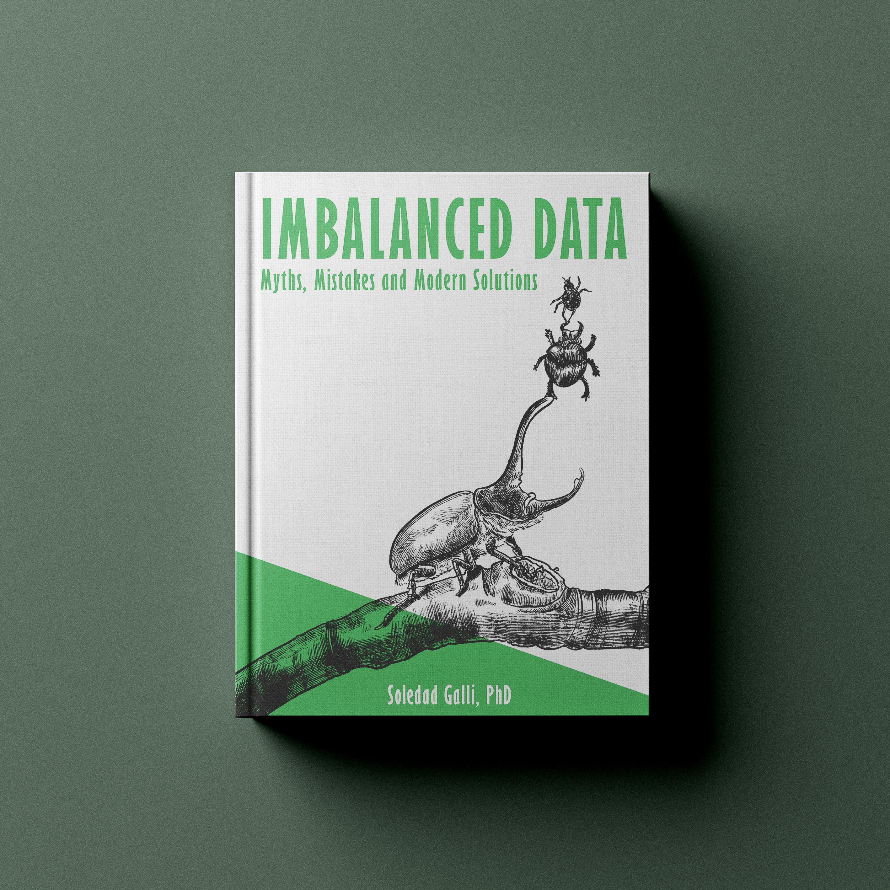

[](https://github.com/solegalli/imbalanced-data-myths-mistakes-solutions/blob/main/LICENSE)
[](https://www.trainindata.com/)

## Imbalanced Data: Myths, Mistakes and Modern Solutions - Code Repository

- Published: June, 2026

[](https://www.trainindata.com/p/imbalanced-data-myths-mistakes-solutions-book)

## Links

- [Book](https://www.trainindata.com/p/imbalanced-data-myths-mistakes-solutions-book)


## Table of Contents

## Table of Contents

1. Introduction to Imbalanced Data
   - 1.1 Imbalanced Datasets: What Are They?
   - 1.2 What Factors Influence the Classification of Imbalanced Datasets?
   - 1.3 The Downside of Resampling
   - 1.4 Prediction is Not Classification
   - 1.5 How to Approach Imbalanced Learning
   - 1.6 Myths, Mistakes and Modern Solutions
   - 1.7 References

2. Metrics that Matter (and Pitfalls to Avoid)
   - 2.1 Understanding the Output of Machine Learning Models
   - 2.2 Understanding What Metrics Measure
   - 2.3 Classification is Not Prediction (Again)
   - 2.4 The Damage of Using Classification Metrics
   - 2.5 Choosing the Right Metric
   - 2.6 Classification Metrics
   - 2.7 Threshold Independent Metrics for Ranking
   - 2.8 Myths, Mistakes and Modern Solutions
   - 2.9 References

3. Probability Calibration: When 70% Means 70%
   - 3.1 Calibrated Probabilities: What are They?
   - 3.2 Assessing Probability Calibration: Reliability Diagrams
   - 3.3 What Makes Calibration Assessment Hard
   - 3.4 What Breaks Probability Calibration
   - 3.5 Scoring Functions: Training Models to Be Calibrated
   - 3.6 Calibration: Correcting Biased Probabilities
   - 3.7 Recalibrating Models in Python
   - 3.8 Myths, Mistakes and Modern Solutions
   - 3.9 References

4. Cost Sensitive Learning: Thresholds, Weights, and Decisions
   - 4.1 Cost Sensitive Learning: What is it?
   - 4.2 Making Cost Sensitive Decisions
   - 4.3 Thresholding, Class Weights and Resampling Are Equivalent
   - 4.4 Cost Sensitive Methods Do Not Improve Model Performance
   - 4.5 Empirical Thresholding: Finding the Right Decision Threshold
   - 4.6 When Cost is Not Class Frequency
   - 4.7 Myths, Mistakes and Modern Solutions
   - 4.8 References

5. Undersampling and Cleaning Methods (coming soon)

6. Oversampling and SMOTE (coming soon)

## Buy the Book

- [Book](https://www.trainindata.com/p/imbalanced-data-myths-mistakes-solutions-book)

## Setup

If you want to run the recipes of this book in a dedicated environment:

**Create and activate a virtual environment**
```bash
python -m venv mlidbook
source mlidbook/bin/activate        # macOS/Linux
mlidbook\Scripts\activate           # Windows
```

**Install dependencies**
```bash
pip install -r requirements.txt
```

**Install Jupyter and register the kernel**
```bash
pip install jupyter ipykernel
python -m ipykernel install --user --name=mlidbook --display-name "mlidbook"
```

The environment will now be available as a kernel named **mlidbook** in Jupyter Notebook.